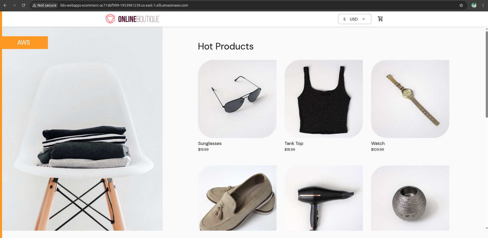
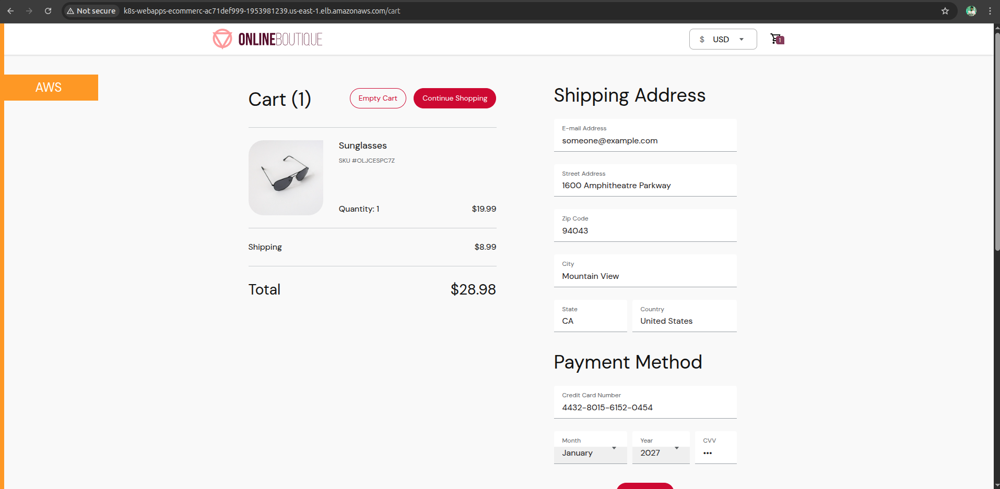

Deploying a production-ready microservices e-commerce platform on Amazon EKS (Elastic Kubernetes Service)

This is a microservices demo application. The application is a web-based e-commerce app where users can browse items, add them to the cart, and purchase them.

This is composed of 11 microservices written in different languages such as Go, C#, Node.js, Python, Java that talk to each other over gRPC. 

| Home Page                                                                                                         | Checkout Screen                                                                                                    |
| ----------------------------------------------------------------------------------------------------------------- | ------------------------------------------------------------------------------------------------------------------ |
|  | 

Challenges faced:
1. Liveness probe failed: timeout: failed to connect service "172.168.1.53:8080" within 1s: context deadline exceeded -> liveness probe initialDelaySeconds was too less, and it was killing the pod too earlt. This was fixed by increasing the time
2. Ingress is created and ingress controller is deployed but alb is not created in aws -> On checking the logs of the alb-controller-pod, the user role was missing the authorization of ec2:DescribeRouteTable action in the AWSLoadBalancerControllerIAMPolicy.

Source of the application code: https://github.com/GoogleCloudPlatform/microservices-demo